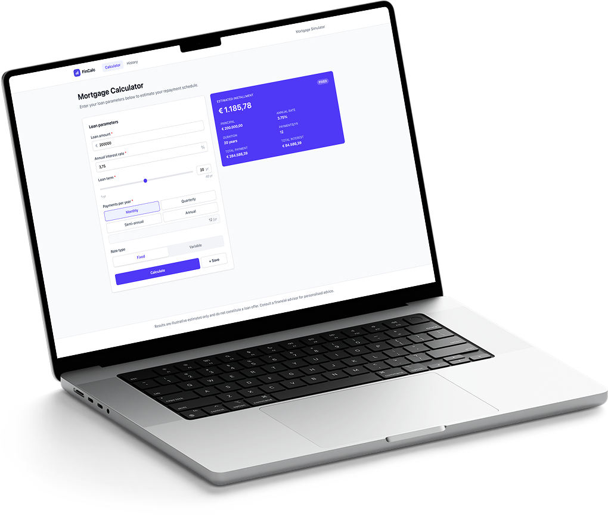
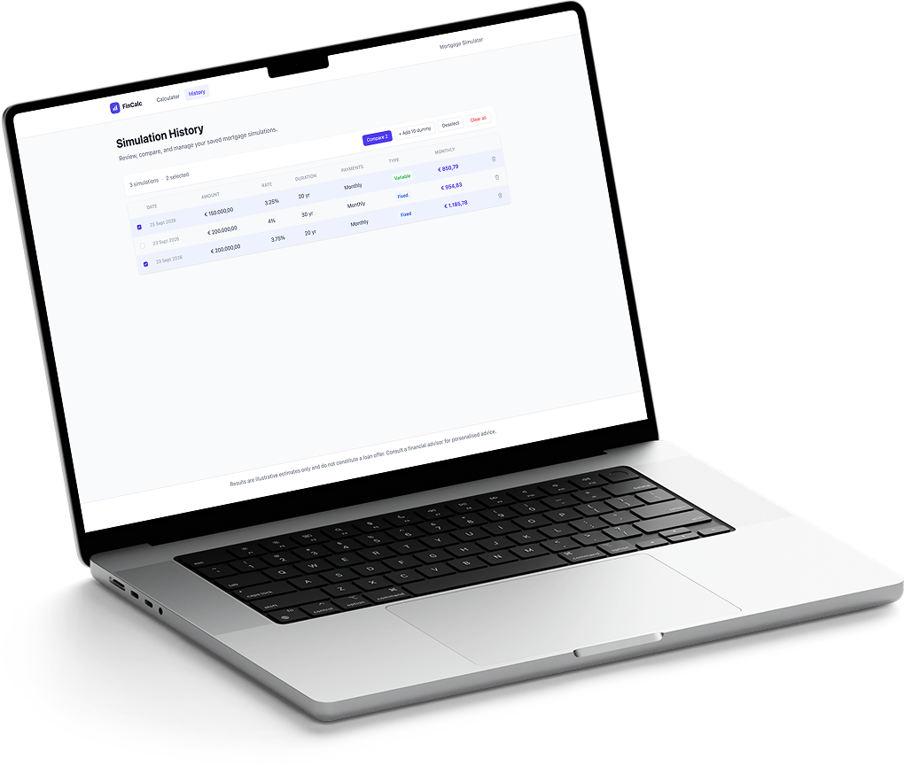
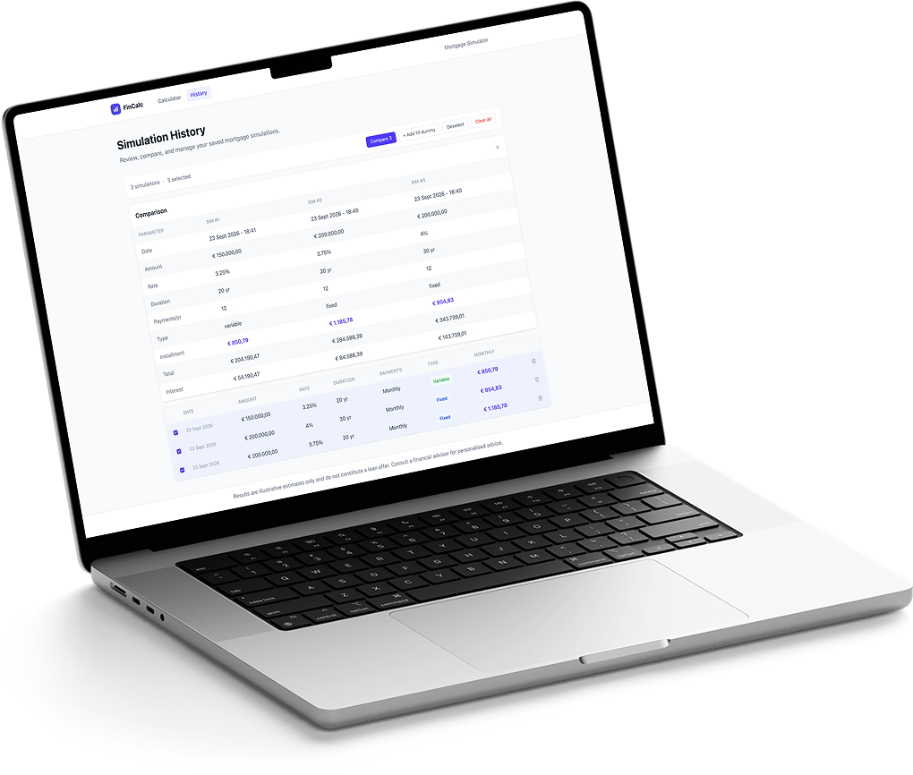

# FinCalc — Mortgage Calculator

A responsive single-page application to estimate mortgage repayments, save simulations and compare them side by side. Built with React 19, Vite and Tailwind CSS as a technical assessment.

## Screenshots

<table>
  <tr>
    <td align="center" width="50%">
      
      <br><sub><b>Calculator</b></sub>
    </td>
    <td align="center" width="50%">
      
      <br><sub><b>History</b></sub>
    </td>
  </tr>
  <tr>
    <td align="center" width="50%">
      
      <br><sub><b>Comparison</b></sub>
    </td>
    <td align="center" width="50%">
      
      <br><sub><b>History on mobile</b></sub>
    </td>
  </tr>
</table>

## Table of contents

- [Screenshots](#screenshots)
- [Features](#features)
- [Tech stack](#tech-stack)
- [Getting started](#getting-started)
- [Available scripts](#available-scripts)
- [Project structure](#project-structure)
- [How it works](#how-it-works)
- [Design decisions](#design-decisions)
- [Testing](#testing)
- [Accessibility](#accessibility)
- [Known limitations and possible improvements](#known-limitations-and-possible-improvements)

## Features

**Calculator**

- Inputs: loan amount, annual interest rate, term (slider synchronized with a numeric input), payment frequency (monthly, quarterly, semi-annual, annual) and rate type (fixed or variable).
- Validation with clear, inline error messages.
- Result card with the estimated installment, total payment and total interest.
- A warning is shown for variable-rate estimates, which are only indicative.
- The result is cleared as soon as an input changes, so a stale result is never displayed.

**History**

- Save any calculation to a history persisted in the browser (`localStorage`).
- Select entries, delete a single one, or clear everything (with a confirmation dialog).
- Compare two or more simulations: a table on desktop, cards grouped by parameter on mobile.
- "Add 10 dummy entries" button to quickly populate the history with realistic random data.

**Experience**

- Responsive layout: side-by-side form and result on large screens, stacked on small ones, with a bottom navigation bar on mobile.
- On stacked layouts the page scrolls to the result after calculating.
- Keyboard and screen-reader friendly (see [Accessibility](#accessibility)).

## Tech stack

| Area | Technology |
| --- | --- |
| UI | [React 19](https://react.dev) (with the React Compiler enabled) |
| Build tool | [Vite](https://vite.dev) |
| Styling | [Tailwind CSS 4](https://tailwindcss.com) |
| Routing | [React Router](https://reactrouter.com) |
| Testing | [Vitest](https://vitest.dev), [Testing Library](https://testing-library.com), jsdom |
| Linting | ESLint (with the React Hooks and React Refresh plugins) |

No state-management or UI libraries are used: local state and small, focused components are enough for this scope.

## Getting started

**Prerequisites:** a recent Node.js LTS release and npm (the project was developed with Node 26).

```bash
# Install dependencies
npm install

# Start the dev server (http://localhost:5173 by default)
npm run dev
```

## Available scripts

| Script | Description |
| --- | --- |
| `npm run dev` | Start the Vite dev server with hot reload |
| `npm run build` | Create a production build in `dist/` |
| `npm run preview` | Serve the production build locally |
| `npm test` | Run the whole test suite once |
| `npm run test:watch` | Run the tests in watch mode |
| `npm run lint` | Lint the codebase with ESLint |

## Project structure

```
src/
├── index.jsx              # Entry point: mounts the app with StrictMode and BrowserRouter
├── App.jsx                # Global layout and route definitions
├── pages/
│   ├── CalculatorPage.jsx # Owns the calculation result; composes form + result card
│   └── HistoryPage.jsx    # Owns history, selection and comparison state
├── components/
│   ├── Container.jsx      # Centered, width-limited wrapper
│   ├── Navbar.jsx         # Top header + mobile bottom navigation
│   ├── Footer.jsx         # Disclaimer
│   ├── Modal.jsx          # Accessible dialog (portal, focus trap, Escape)
│   ├── loan/              # Calculator UI: LoanForm, ResultCard, FormField, toggles
│   └── history/           # History UI: table/card lists, comparison views, toolbar, modal
├── config/
│   ├── loanDefaults.js    # Form options, input constraints and initial values
│   └── comparisonRows.js  # Rows shown in the comparison views
├── hooks/
│   └── useMediaQuery.js   # Reactive CSS media query hook
├── utils/
│   ├── mortgage.js        # Pure calculation logic
│   ├── format.js          # Currency, date and frequency formatting
│   ├── storage.js         # localStorage persistence of the history
│   └── dummyData.js       # Random history entries generator
└── test/                  # Test setup and helpers
```

Tests live next to the code they cover (`*.test.js` / `*.test.jsx`).

## How it works

### Data flow

```
LoanForm ──onCalculate(values)──▶ CalculatorPage ──calculateMortgage()──▶ result ──▶ ResultCard
                                        │
                                        └──onSave()──▶ saveCalculation() ──▶ localStorage
                                                                                  │
HistoryPage ◀── getHistory() ─────────────────────────────────────────────────────┘
```

- `LoanForm` is a controlled form. It validates the inputs and reports the parsed values to its parent, without knowing anything about the calculation.
- `CalculatorPage` computes the result with `calculateMortgage` and passes it to `ResultCard`.
- `HistoryPage` reads the history once from `localStorage` and keeps it in state; every mutation updates both the storage and the state.

### The calculation

`calculateMortgage` uses the **French amortization method** (*ammortamento alla francese*): a fixed-rate loan repaid with a constant installment, where interest is computed on the outstanding balance, so each payment contains less interest and more principal over time.

```
installment = P · i · (1 + i)^n / ((1 + i)^n − 1)

P = loan amount
i = annual rate / 100 / payments per year
n = term in years × payments per year
```

- With a 0% rate the formula would divide by zero, so the installment is simply `P / n`.
- `totalPayment = installment × n` and `totalInterest = totalPayment − P`.
- Values are **not rounded** in the logic layer; rounding happens only when formatting for display.

### History entry shape

```js
{
  id: 'uuid',                  // generated on save
  date: '2025-03-07T10:15:00Z', // ISO 8601
  amount: 250000,
  rate: 3.75,                  // annual %, e.g. 3.75 for 3.75%
  duration: 20,                // years
  payments: 12,                // payments per year
  type: 'Fixed',               // 'Fixed' | 'Variable'
  monthly: 1482.22,            // installment per payment period
  total: 355732.99,
  interest: 105732.99,
}
```

## Design decisions

- **Separation of concerns.** Business logic (`utils/`), configuration (`config/`) and presentation (`components/`, `pages/`) are kept apart. The calculation and formatting functions are pure and easy to test.
- **Configuration over magic numbers.** Form options, limits and defaults live in `config/loanDefaults.js`, and the comparison rows in `config/comparisonRows.js`, so the two comparison views always stay consistent and adding a row is a one-line change.
- **Single source of truth for state.** Each page owns the state its children need and passes it down through props and callbacks. Presentational components (toolbar, lists, badges, buttons) hold no business state.
- **Two layouts, one data source.** History and comparison render as a table on desktop and as cards on mobile. The switch is done in JavaScript through the `useMediaQuery` hook (built on `useSyncExternalStore`), because the two views have genuinely different markup.
- **Safe persistence.** Reads from `localStorage` never throw: corrupted or unavailable storage falls back to an empty history.
- **Reusable accessible primitives.** `Modal`, `FormField`, `ToggleGroup`, `SegmentedToggle`, `SelectionCheckbox` and `DeleteButton` encapsulate their accessibility behavior once and are reused.
- **Documented code.** Modules, components and non-obvious logic are documented with JSDoc and inline comments.

## Testing

```bash
npm test
```

The suite covers the calculation, formatting and storage utilities, the `useMediaQuery` hook, the form and result components, the history lists and comparison views, the modal, and both pages. Component tests use Testing Library and query the UI the way a user (or a screen reader) would, by role and accessible name. Viewport-dependent behavior is tested with a small `mockViewportWidth` helper (`src/test/viewport.js`) that fakes `window.matchMedia`.

## Accessibility

- Semantic structure: `main`, `header`, `nav`, `footer`, headings and real form controls.
- Every form control has a label; errors are announced with `role="alert"` and linked to their field with `aria-describedby`; invalid fields expose `aria-invalid`.
- The modal uses `role="dialog"` and `aria-modal`, traps focus, closes with Escape and restores focus to the element that opened it.
- The current page is exposed with `aria-current="page"` in both navigation bars.
- Icon-only buttons have accessible names, and list actions include the entry position and date so each one is unique for screen readers.
- Dynamic updates (payment frequency recap, save confirmation) use `aria-live`.

## Known limitations and possible improvements

- **Arrow-key navigation** is not implemented in the radio-style toggles (`ToggleGroup`, `SegmentedToggle`); they currently work with click and Tab/Enter/Space.
- **Field naming:** history entries use `monthly` for the installment per period, which is only monthly when the frequency is monthly. Renaming it (e.g. `installment`) would require a storage migration.
- **No input validation inside `calculateMortgage`:** it assumes the form already validated the values (a term or frequency of 0 would produce `Infinity`/`NaN`).
- **Storage writes are not guarded:** unlike reads, writes to `localStorage` can throw if the storage is full or blocked.
- **Currency and locale are fixed** (euro, Italian number formatting); making them configurable would be a natural extension.
- Possible next steps: Export of simulations (CSV/PDF), and end-to-end tests.
